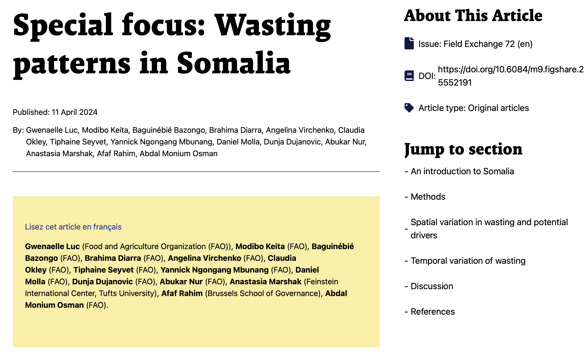
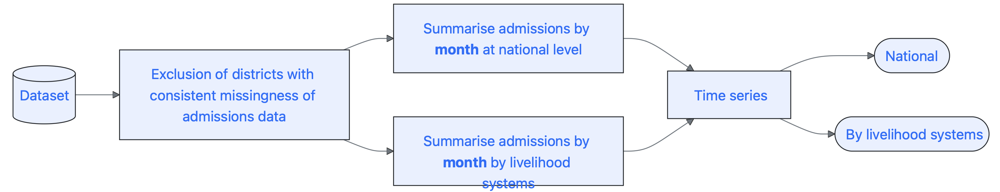
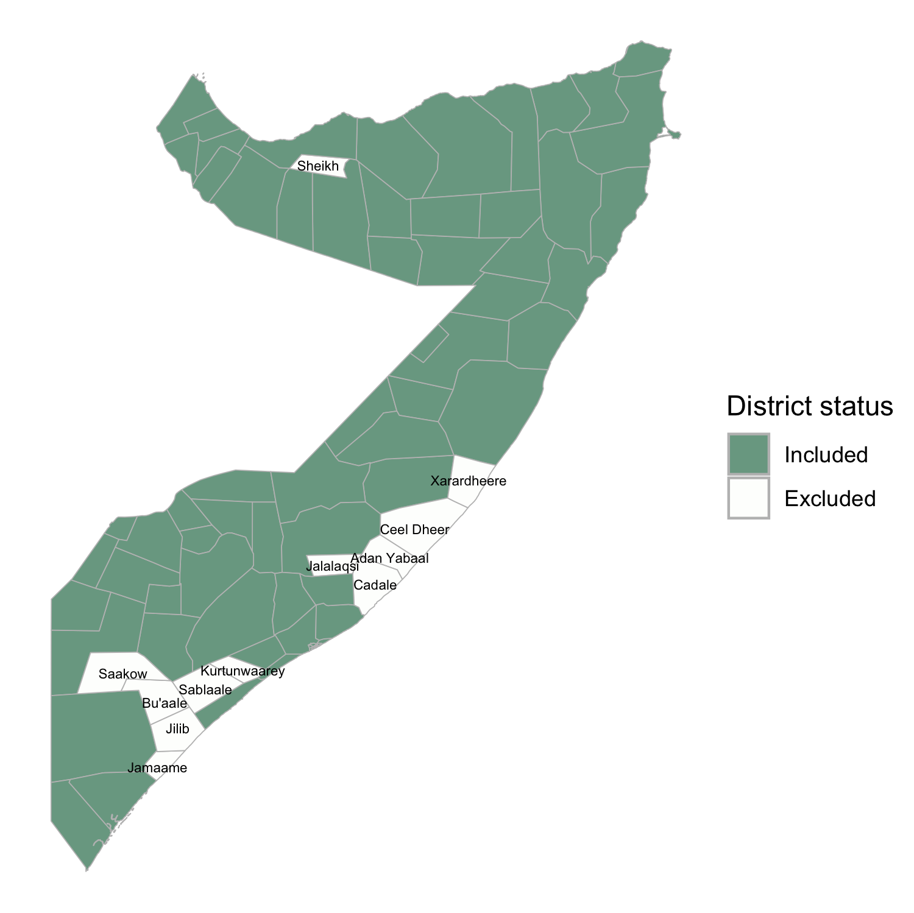
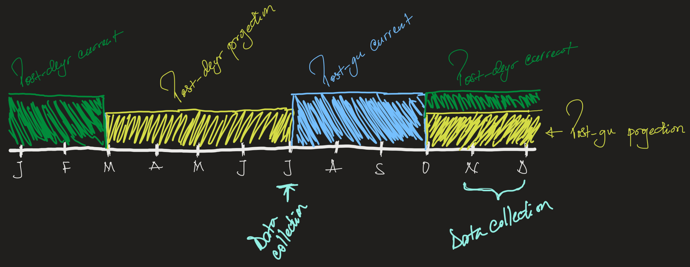

```{r}
#| label: source-script
Sys.setenv(path_secret_key = "~/.ssh/id_rsa")
source("script.R")
```

## {.smaller} 
### Context


<br> 

::: {.incremental}
+ Seasonality/seasonal variation refers to recurring patterns at specific times of the year. 
&nbsp;
+ It has impact on the underlying and immediate factors that drives acute malnutrition (AMN). 
&nbsp;
+ It is known that AMN has a seasonal variation, however limited evidence is available to substantiate that.  
  - Stakeholders often rely on assumptions of an AMN seasonal peak during the food security lean season.  
    - Nutrition surveys are routinely timed to coincide with the lean season each year. 
::: 

## {.smaller} 
### Somalia's Food Security Seasonal Calendar 

::: {.incremental}
```{mermaid}
%%| label: seasonal-calendar
%%| fig-cap-location: bottom
%%| fig-height: 6
%%| fig-width: 14
gantt
    dateFormat M
    axisFormat %b
    todayMarker off
    section Seasons
    Jilaal :1, 4
    Gu     :4, 7
    Post-Gu:7, 8
    Hagaa  :7, 10
    Deyr   :10, 12
```

+ It is generally assumed that AMN in Somalia peaks from the end of the Jilaal season to the end of the Gu season.
:::

## {.smaller}
### Regional Literature 

A few studies were conducted in the region using SMART survey data: 

::: {.incremental}
+ 2 studies using 15 years of SMART survey data **in African drylands** (excluding Somalia) underscored the complex relationship between AMN and acute food insecurity: 
  - AMN and food security seasons do not always align across seasons or livelihoods. 
  - Identified two AMN seasonal peaks: **April-May** and **August-September**  

<br>

+ Somalia-specific analysis used 8 years FSNAU and ACF SMART surveys (2014-2021):  

  - Seasonal peak 1: **May/June (the beginning of Gu)** 
  - Seasonal peak 2: **November (mid-Deyr)** with a decline during the lean season.
      - This was the highest peak observed. May/June was the second high. 
  - There were variations in the patterns according to the livelihood system (pastoralist, agropastoralist and farming)

:::

## 



## {.smaller} 
### What Additional Value Does This Analysis Bring?

<br> 

This analysis examines six years of severe acute malnutrition (SAM) admission data from treatment programs in Somalia to explore patterns in admissions, focusing on **trends and seasonality** over time.  

<br> 

#### Objectives  

  + **Identify and describe trend patterns**: a long-term direction or movement in the admissions that persists across the series. This represents underlying patterns in the admissions after removing short-term fluctuations. 

  + **Identify and describe the seasonal patterns**: recurring patterns that occur in a fixed and specific period every year. In this study, this refers to monthly recurring patterns over the years.


# Methods
## {.smaller} 
### Data Source

<br> 

[Somalia Nutrition Cluster's](https://response.reliefweb.int/somalia/nutrition) six years SAM admissions. 

  - The data is reported monthly at district level.

## {.smaller} 
### Data Wrangling 


<br> 

{width="350"}


## {.smaller}
### Exclusion and Inclusion Criteria



## {.smaller}
### Analysis Approach

<br>

::: {.incremental}
1. Explored visually through graphs to identify patterns over time
2. It was broken down into components to examine the overall monthly trend and seasonal variation
3. The average rate of change (ARC) ^[The ARC describes the average or typical rate of change (in the admissions of SAM cases in this case) over a determined time interval of interest in the time series.] was calculated to better understand the trend: 

    $ARC = \frac{\text{admission}_{f}  -  \text{admission}_{i}}{\text{time}_{f}  -  \text{time}_{i}}$


4. Data was split into livelihood systems.
:::

# Results  
National

## {.smaller}
#### A Glance at Admissions Over Time

```{r}
#| label: timeplot-national
#| fig-width: 20
#| fig-height: 9.5
tsplot_national
```

## {.smaller}
#### A Glance at Admissions Over Time (Month/Year)

```{r}
#| label: seasonal-plot-national
#| fig-width: 20
#| fig-height: 9.5
ssnplot_national
```

## {.smaller}
#### A Glance at Admissions Over Time (Month/Year)
:::: {.columns}

::: {.column width="50%" style="text-align: center;"}
Before 2022

```{r}
#| label: seasonal-plot-b2022
#| fig-height: 8
ssplot_national_b2022
```
:::

::: {.column style="text-align: center;"}
As of 2022

```{r}
#| label: seasonal-plot-a2022
#| fig-height: 8
ssplot_national_a2022
```
:::

::::

## {.smaller}
#### Decomposed Components of Admissions Over Time

```{r}
#| label: cmpnts-national
#| fig-width: 20
#| fig-height: 9.5
cmpnts_plot_national
```

## {.smaller}
####  Trend in Focus: Periods of Notable Directional Shifts
```{r}
#| label: piecewise-slopes
#| fig-subcap: 
#|   - "Jan-Jun 2019"
#|   - "Jul-Oct 2019"
#|   - "Nov 2019-Feb 2020"
#|   - "Mar 2020-Jan 2021"
#|   - "Feb 2021-Mar 2023"
#|   - "Apr 2023-Dec 2024"
#| layout-ncol: 3
#| layout-nrow: 2

slope_beforeJul2019
slope_jul2019_oct2019
slope_nov2019_feb2020
slope_mar2020_jan2021
slope_feb2021_mar2023
slope_april2023_dec2024
```

## {.smaller}  
#### Trend in Focus: The Average Rate of Change (ARC)

<br> 

| Slope | Time interval | Admissions~i~ | Admissions~f~ | ARC |  
| :---: | :---: | :---: | :---: | :---: |
| (a) | `r arc_beforeJul2019[[5]]` | `r format(round(arc_beforeJul2019[[1]]),F,big.mark=",")` | `r format(round(arc_beforeJul2019[[3]]),F,big.mark=",")` | `r round(arc_beforeJul2019[[6]])` |  
| (b) | `r arc_aug2019_oct2019[[5]]` | `r format(round(arc_aug2019_oct2019[[1]]),F, big.mark=",")` | `r format(round(arc_aug2019_oct2019[[3]]),F,big.mark=",")` | `r round(arc_aug2019_oct2019[[6]])` | 
| (c) | `r arc_nov2019_feb2020[[5]]` | `r format(round(arc_nov2019_feb2020[[1]]),F,big.mark=",")` | `r format(round(arc_nov2019_feb2020[[3]]),F,big.mark=",")` | `r round(arc_nov2019_feb2020[[6]])` | 
| (d) | `r arc_mar2020_jan2021[[5]]` | `r format(round(arc_mar2020_jan2021[[1]]),F,big.mark=",")` | `r format(round(arc_mar2020_jan2021[[3]]),F,big.mark=",")` | `r round(arc_mar2020_jan2021[[6]])` | 
| (e) | `r arc_feb2021_mar2023[[5]]` | `r format(round(arc_feb2021_mar2023[[1]]),F,big.mark=",")` | `r format(round(arc_feb2021_mar2023[[3]]),F, big.mark=",")` | `r format(round(arc_feb2021_mar2023[[6]]),big.mark=",")` | 
| (f) | `r arc_april2023_dec2024[[5]]` | `r format(round(arc_april2023_dec2024[[1]]),F, big.mark=",")` | `r format(round(arc_april2023_dec2024[[3]]),F,big.mark=",")` | `r format(round(arc_april2023_dec2024[[6]]),big.mark=",")` | 

: The average rate of change of admissions by month in the time-intervals {#tbl-arc-national}

## {.smaller}
#### Seasonal Variation in Focus

```{r}
#| label: seasonal-pattern-national
#| fig-width: 20
#| fig-height: 9.5
seasonal_cmpnt_national
```

## {.smaller}
#### Seasonal Variation in Focus: Before and As of 2022

:::: {.columns}

::: {.column width="50%" style="text-align: center;"}
```{r}
#| label: seasonal-pattern-natioanal-b2022
#| fig-height: 8
seasonal_cmpnt_national_b2022
```
:::

::: {.column style="text-align: center;"}
```{r}
#| label: seasonal-pattern-natioanal-a2022
#| fig-height: 8
seasonal_cmpnt_national_a2022
```
:::

::::

# Results  
By Livelihood Systems

## {.smaller} 
#### Spatial Distribution of Somalia's Livelihood System

:::: {.columns}
::: {.column width="40%" style="text-align: center;"}


<br> 

| Livelihood system | Number of districts |
| :-- | :-: |
| Pastoral | 34 |
| Agropastoral | 19 |
| Riverine | 5 |
| Urban/IDPs | 5 |  

: Number of districts in each livelihood system {#tbl-lsystem-districts}
:::

::: {.column style="text-align: center;"}
```{r}
#| label: livelihood-systems
#| fig-width: 10
#| fig-height: 9
#| fig-dpi: 300
#| out.width: "100%"
map_lsystems
```
:::
::::

## {.smaller}
#### A Glance at Admissions Over Time

```{r}
#| label: timeplot-lsystem
#| fig-width: 20
#| fig-height: 9.5
tsplot_lsysttem
```

# Results
The Decomposed Components of Admissions Over Time: **By Livelihood Systems**  

  + _Pastoral_  

## {.smaller}
#### Decomposed Components of Admissions Over Time

```{r}
#| label: cmpnts-pastoral
#| fig-width: 20
#| fig-height: 9.5
cmpnts_plot_pastoral
```

## {.smaller}
####  Trend in Focus: Periods of Notable Directional Shifts
```{r}
#| label: piecewise-slopes-pastoral
#| fig-subcap: 
#|   - "Jan-May 2019"
#|   - "Jun-Sep 2019"
#|   - "Oct 2019-Aug 2020"
#|   - "Sep 2020-Apr 2021"
#|   - "May 2021-Dec 2022"
#|   - "Jan 2023-Dec 2024"
#| layout-ncol: 3
#| layout-nrow: 2

slope_pastoral_beforemay2019
slope_pastoral_jun_sep2019
slope_pastoral_oct2019_aug2020
slope_pastoral_sep2020_apr2021
slope_pastoral_may2021_dec2022
slope_pastoral_jan2023_dec2024
```

## {.smaller}
#### Seasonal Variation in Focus

```{r}
#| label: seasonal-pattern-pastoral
#| fig-width: 20
#| fig-height: 9.5
seasonal_cmpnt_pastoral
```

# Results
The Decomposed Components of Admissions Over Time: **By Livelihood Systems**  

  + _Agropastoral_  

## {.smaller}
#### Decomposed Components of Admissions Over Time

```{r}
#| label: cmpnts-agropastoral
#| fig-width: 20
#| fig-height: 9.5
cmpnts_plot_agropastoral
```

## {.smaller}
####  Trend in Focus: Periods of Notable Directional Shifts
```{r}
#| label: piecewise-slopes-agropastoral
#| fig-subcap: 
#|   - "Jan 2019-Jan 2020"
#|   - "Feb 2020-Jan 2021"
#|   - "Feb 2021-Feb 2023"
#|   - "Mar 2023-Dec 2024"
#| layout-ncol: 2
#| layout-nrow: 2
#| fig-width: 17
#| fig-height: 7
slope_agropastoral_beforefeb2020
slope_agropastoral_feb2020_jan2021
slope_agropastoral_feb2021_feb2023
slope_agropastoral_mar2023_dec2024
```

## {.smaller}
#### Seasonal Variation in Focus

```{r}
#| label: seasonal-pattern-agropastoral
#| fig-width: 20
#| fig-height: 9.5
seasonal_cmpnt_agropastoral
```

# Results
The Decomposed Components of Admissions Over Time: **By Livelihood Systems**  

  + _Riverine_  

## {.smaller}
#### Decomposed Components of Admissions Over Time

```{r}
#| label: cmpnts-riverine
#| fig-width: 20
#| fig-height: 9.5
cmpnts_plot_riverine
```

## {.smaller}
####  Trend in Focus: Periods of Notable Directional Shifts
```{r}
#| label: piecewise-slopes-riverine
#| fig-subcap: 
#|   - "Jan 2019-May 2020"
#|   - "Jun 2019-Nov 2020"
#|   - "Dec 2020-Apr 2021"
#|   - "May 2021-Sep 2021"
#|   - "Oct 2021-Aug 2023"
#|   - "Sep 2023-Dec 2024"
#| layout-ncol: 3
#| layout-nrow: 2
slope_riverine_beforemay2020
slope_riverine_jun_nov2020
slope_riverine_dec2020_apr2021
slope_riverine_may2021_sep2021
slope_riverine_oct2021_aug2023
slope_riverine_sep2023_dec2024
```

## {.smaller}
#### Seasonal Variation in Focus

```{r}
#| label: seasonal-pattern-riverine
#| fig-width: 20
#| fig-height: 9.5
seasonal_cmpnt_riverine
```

# Results
The Decomposed Components of Admissions Over Time: **By Livelihood Systems**  

  + _Urban/IDPs_  

## {.smaller}
#### Decomposed Components of Admissions Over Time

```{r}
#| label: cmpnts-urban-idps
#| fig-width: 20
#| fig-height: 9.5
cmpnts_plot_urban_idps
```

## {.smaller}
####  Trend in Focus: Periods of Notable Directional Shifts

```{r}
#| label: piecewise-slopes-urban-idps
#| fig-subcap: 
#|   - "Jan 2019-May 2019"
#|   - "Jun 2019-Nov 2019"
#|   - "Dec 2019-Feb 2020"
#|   - "Mar 2019-Feb 2021"
#|   - "Mar 2021-Apr 2021"
#|   - "May 2021-Aug 2021"
#|   - "Sep 2021-Mar 2023"
#|   - "Apr 2023-Dec 2024"
#| layout-ncol: 4
#| layout-nrow: 2
#| fig-height: 7

slope_urban_idps_beforemay2019
slope_urban_idps_jun2019_nov2019
slope_urban_idps_dec2019_feb2020
slope_urban_idps_mar2019_feb2021
slope_urban_idps_mar2021_apr2021
slope_urban_idps_may2021_aug2021
slope_urban_idps_sep2021_mar2023
slope_urban_idps_afterapr2023
```

## {.smaller}
#### Seasonal Variation in Focus

```{r}
#| label: seasonal-pattern-urban-idps
#| fig-width: 20
#| fig-height: 9.5
seasonal_cmpnt_urban_idps
```


# From Graphs 📈 to Calendar 🗓️: A Simple View of AMN Seasonality

## 
::: {.incremental}

+ Currently, the analyses parameters of the AMN go hand-in-hand with those of the IPC AFI



+ This analysis's findings suggest that the AMN analyses parameters need to be re-thought to match the times when, de facto, AMN evolution changes. 
    - This should be sensitive to the existing livelihood systems. 

:::

## {.smaller}
#### Pastoral Livelihood System

::: {.gantt-pastoral}
```{mermaid}
%%| label: amn-seasonal-calendar-pastoral
%%| fig-cap-location: bottom
%%| fig-height: 5
%%| fig-width: 14
gantt
    title  Pastoral Livelihood Systems' AMN Seasonal Calendar
    dateFormat M
    axisFormat %b
    todayMarker off
    section AMN Seasons
    Peak :1, 2
    Low nadir :2, 5
    High peak 1 :5, 7
    Nadir :7, 10
    High peak 2 :10, 12
```
:::


 + **Summary:**
    - 2 High AMN seasons
    - 2 Low AMN seasons

## {.smaller}
#### Agropastoral Livelihood System

::: {.gantt-agropastoral}
```{mermaid}
%%| label: amn-seasonal-calendar-agropastoral
%%| fig-cap-location: bottom
%%| fig-height: 5
%%| fig-width: 14
gantt
    title  Agropastoral Livelihood Systems' AMN Seasonal Calendar
    dateFormat M
    axisFormat %b
    todayMarker off
    section AMN Seasons
    Peak :1, 2
    Low nadir :2, 5
    High peak :5, 9
    Nadir :9, 11
    Peak : 11, 12
```
:::


 + **Summary:**
    - 2 High AMN seasons
    - 2 Low AMN seasons

## {.smaller}
#### Riverine livelihood system

::: {.gantt-riverine}
```{mermaid}
%%| label: amn-seasonal-calendar-riverine
%%| fig-cap-location: bottom
%%| fig-height: 5
%%| fig-width: 14
gantt
    title  Riverine Livelihood Systems' AMN Seasonal Calendar
    dateFormat M
    axisFormat %b
    todayMarker off
    section AMN Seasons
    High peak :1, 3
    Nadir :3, 4
    Peak: 4, 5
    Nadir :5, 7
    Peak :7, 9
    Low nadir :9, 11
    High peak :11, 12
```
:::

 + **Summary:**
    - 3 High AMN seasons
    - 3 Low AMN seasons

::: {.notes}
+ I find this graph difficult to extract a tidy seasonal calendar. 
+ Seasonal variation in February goes down to the trend line, so I considered high as it comes from high. 
:::

## {.smaller}
#### Urban/IDPs Livelihood System

::: {.gantt-urban-idps}
```{mermaid}
%%| label: amn-seasonal-calendar-urbanipds
%%| fig-cap-location: bottom
%%| fig-height: 5
%%| fig-width: 14
gantt
    title  Urban/IDPs Livelihood Systems' AMN Seasonal Calendar
    dateFormat M
    axisFormat %b
    todayMarker off
    section AMN Seasons
    Low nadir :1, 5
    High peak :5, 8
    Nadir :8, 9
    Peak :9, 12
```
:::

 + **Summary:**
    - 2 High AMN seasons
    - 2 Low AMN seasons


# Do These Seasonal Patterns Align with Food Security Seasonality 🧐 🤔 ?

##
#### Pastoral Livelihood System

::: {.gantt-afiamn-pastoral}
```{mermaid}
%%| label: afi-amn-calendar-pastoral
%%| fig-cap-location: bottom
%%| fig-height: 7
%%| fig-width: 14

gantt
    title AFI vs AMN Seasonal Calendars
    dateFormat M
    axisFormat %b
    todayMarker off

    section Local Seasons
    High peak 2 :amn1, 1, 2
    Low nadir :amn2, 2, 5
    High peak 1 :amn3, 5, 7
    Nadir :amn4, 7, 10
    High peak 2 :amn5, 10, 12

    section National Seasons
    Peak :ntl1, 1, 2
    Low nadir :ntl2, 2, 5
    High peak :ntl3, 5, 7
    Nadir :ntl4, 7, 11
    Peak :ntl5, 11, 12

    section Luc et al. (2024)
    Not available :luc1, 1, 5
    High peak :luc2, 5, 6
    Not available :luc3, 6, 10
    Peak :luc4, 10, 11
    Not avail. :luc5, 11, 12

    section AFI National Seasons
    Jilaal :afi1, 1, 4
    Gu     :afi2, 4, 7
    Post-Gu:afi3, 7, 8
    Hagaa  :afi4, 7, 10
    Deyr   :afi5, 10, 12
```
:::

##
#### Agropastoral Livelihood System

::: {.gantt-afiamn-agropastoral}
```{mermaid}
%%| label: afi-amn-calendar-agropastoral
%%| fig-cap-location: bottom
%%| fig-height: 7
%%| fig-width: 14

gantt
    title AFI vs AMN Seasonal Calendars
    dateFormat M
    axisFormat %b
    todayMarker off

    section Local Seasons
    High peak :amn1, 1, 2
    Lower nadir :amn2, 2, 5
    Higher peak :amn3, 5, 9
    Low nadir :amn4, 9, 11
    High peak : amn5, 11, 12

    section National Seasons
    Peak :ntl1, 1, 2
    Low nadir :ntl2, 2, 5
    High peak :ntl3, 5, 7
    Nadir :ntl4, 7, 11
    Peak :ntl5, 11, 12

    section Luc et al. (2024)
    Not available :luc1, 1, 5
    High peak :luc2, 5, 6
    Not available :luc3, 6, 10
    Peak :luc4, 10, 11
    Not avail. :luc5, 11, 12

    section AFI National Seasons
    Jilaal :afi1, 1, 4
    Gu     :afi2, 4, 7
    Post-Gu:afi3, 7, 8
    Hagaa  :afi4, 7, 10
    Deyr   :afi5, 10, 12
```
:::

##
#### Riverine Livelihood System

::: {.gantt-afiamn-riverine}
```{mermaid}
%%| label: afi-amn-calendar-riverine
%%| fig-cap-location: bottom
%%| fig-height: 7
%%| fig-width: 14

gantt
    title AFI vs AMN Seasonal Calendars
    dateFormat M
    axisFormat %b
    todayMarker off

    section Local Seasons
    High peak :amn1, 1, 3
    Nadir :amn2, 3, 4
    Peak :amn3, 4, 5
    Nadir :amn4, 5, 7
    Peak :amn5, 7, 9
    Low nadir :amn6, 9, 11
    High peak :amn7, 11, 12

    section National Seasons
    Peak :ntl1, 1, 2
    Low nadir :ntl2, 2, 5
    High peak :ntl3, 5, 7
    Nadir :ntl4, 7, 11
    Peak :ntl5, 11, 12

    section Luc et al. (2024)
    Not available :luc1, 1, 5
    High peak :luc2, 5, 6
    Not available :luc3, 6, 10
    Peak :luc4, 10, 11
    Not avail. :luc5, 11, 12

    section AFI National Seasons
    Jilaal :afi1, 1, 4
    Gu     :afi2, 4, 7
    Post-Gu:afi3, 7, 8
    Hagaa  :afi4, 7, 10
    Deyr   :afi5, 10, 12
```
:::

##
#### Urban/IDPs Livelihood System

::: {.gantt-afiamn-urban}
```{mermaid}
%%| label: afi-amn-calendar-urbanidps
%%| fig-cap-location: bottom
%%| fig-height: 7
%%| fig-width: 14

gantt
    title AFI vs AMN Seasonal Calendars
    dateFormat M
    axisFormat %b
    todayMarker off

    section Local Seasons
    Lower nadir :amn1, 1, 5
    Higher peak :amn2, 5, 8
    Low nadir :amn3, 8, 9
    High peak :amn4, 9, 12

    section National Seasons
    Peak :ntl1, 1, 2
    Low nadir :ntl2, 2, 5
    High peak :ntl3, 5, 7
    Nadir :ntl4, 7, 11
    Peak :ntl5, 11, 12

    section Luc et al. (2024)
    Not available :luc1, 1, 5
    High peak :luc2, 5, 6
    Not available :luc3, 6, 10
    Peak :luc4, 10, 11
    Not avail. :luc5, 11, 12

    section AFI National Seasons
    Jilaal :afi1, 1, 4
    Gu     :afi2, 4, 7
    Post-Gu:afi3, 7, 8
    Hagaa  :afi4, 7, 10
    Deyr   :afi5, 10, 12
```
:::


# Discussion 

## Trend {.smaller}

<br> 

+ The magnitude of admissions increased remarkably as of the 3rd quarter of 2021 until 2023 (`r arc_feb2021_mar2023[[5]]` months) when it started to decrease slowly.

+ The average number of cases admitted during this period increased by `r format(round(arc_feb2021_mar2023[[6]]),big.mark=",")` cases each month.

+ The increased trend reflects the intensified program response at the time, to fit the also increased needs.
    - even after the drought has passed, the magnitude of the admissions remained excessively high, compared to years before the drought, although it shows a downward trend

::: {.callout-caution}
This suggests that the programme response remained high even after. This means that in case the programme becomes underfunded in a short-term, many children will be left untreated due to the scale-down of its capacity.

💡 What was forecasted in the March projection update, as a result of the defunding.
:::

## Seasonal Variation (1/3) {.smaller}

<br> 

+ **Pastoral and agropastoral** livelihood systems: 

    - The high-peak is consistently observed in May-June;
    - Another peak in January, with a start in **November for the pastoral**, and in **December for the agropastoral** systems.
    - The lowest nadir occurs in April in both systems. 

## Seasonal Variation (2/3) {.smaller}

<br>

+ **Riverine livelihood system**: 
    - The high-peak occurs in December-January, followed by several smaller peaks throughout the year, indicating a more fragmented seasonal pattern.
    - The pattern in the riverine differ remarkably from the other system. **It is the only system where the high-peak does not occur in May-June**

::: {.callout-note}
These patterns also diverge from Luc., et all (2024) observations, which identified the higher peak in November
:::

::: {.callout-important}
An insteresting finding is that the riverine and pastoral, are the only livelihood systems where there is a peak in March before the lower nadir in April.
**Why is that??** *Question to the Nutrition Cluster members.*
:::

## Seasonal Variation (3/3) {.smaller}

+ **Urban/IDPs livelihood system**: 
    - Exhibits a unique and intriguing pattern compared to the others.
    - While the highest peak consistently occurs in May-June, similar to most other systems (except the riverine), the admissions in January notably align with the trend line (baseline) every year; 
    - From February onward, the admissions begin a continuous decline, reaching the common lowest nadir in April.

::: {.callout-note}
This distinct pattern could not be compared to previous studies, as they did not include a specific livelihood category for urban areas and/or IDPs.
:::

## 


+ The discrepancies in the months in findings may be related to the fact that the survey data used were collected over a specific time period, while the admissions are reported monthly over the years. 

<br>

+ This also explains the absence of a nadir in April in the author's study, as all surveys were undertaken starting in May and then November to December.

# ...Mahadsanid 😀